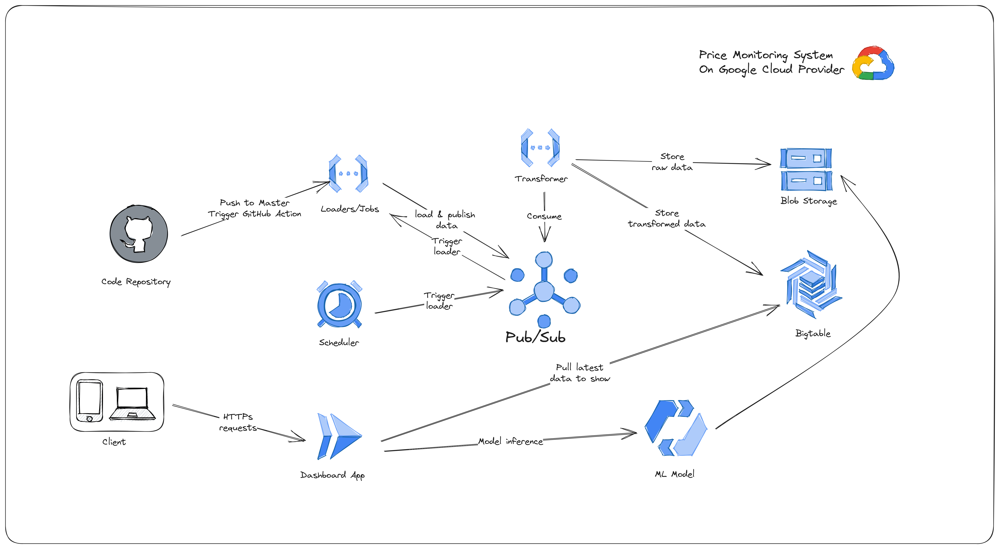

The Real-time Ecommerce Data Collection and Processing project offers a robust and efficient solution for gathering data from various ecommerce websites, processing it in real-time, and storing it in Google Cloud Datastore. The project comprises two parts: a Golang-based data processing pipeline named "Topic2Warehouse" and a Python-based web scraper and publisher.

**Golang Data Processing Pipeline (Topic2Warehouse):**

The Golang pipeline is responsible for real-time data processing and storage. It subscribes to Google Cloud Pub/Sub, receiving data sent from the Python scraper. The received data is then stored securely in Google Cloud Datastore, providing reliable and scalable data storage capabilities. The pipeline leverages Golang's concurrency features, ensuring high throughput and seamless handling of incoming data from multiple sources.

**Python Web Scraper and Publisher:**

The Python application excels in web scraping, collecting valuable ecommerce data from various websites. The scraper uses Python's BeautifulSoup library for HTML parsing and efficiently extracts relevant product details. After scraping, the data is published to Google Cloud Pub/Sub, enabling real-time data transfer to the Golang data processing pipeline.

